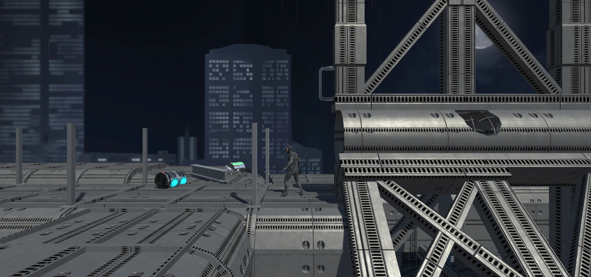
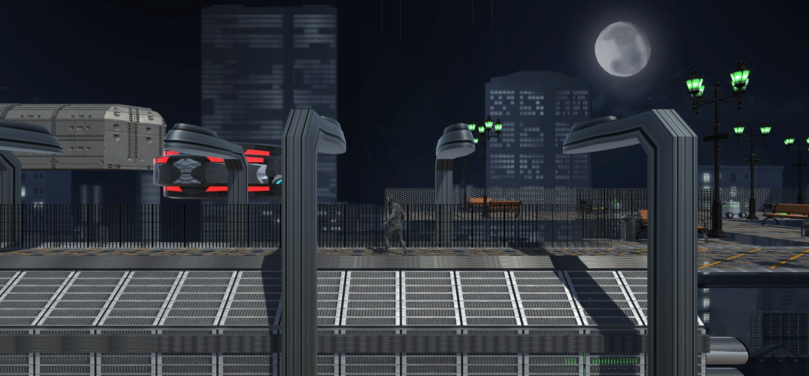

# Phaser
My first take on Unity platformer game.

## About The Project
Phaser is a 2.5 D platformer game set in a sci-fi world and made in Unity.

## Requirements
Make sure you have the below requirements before starting:

+ Unity version 2020.3.2f1 or higher

## Installation

+ Clone the repository locally:
```
git clone https://github.com/DankanMitius/Phaser.git
```

You can run the game by opening the project in Unity.

## Screenshots



