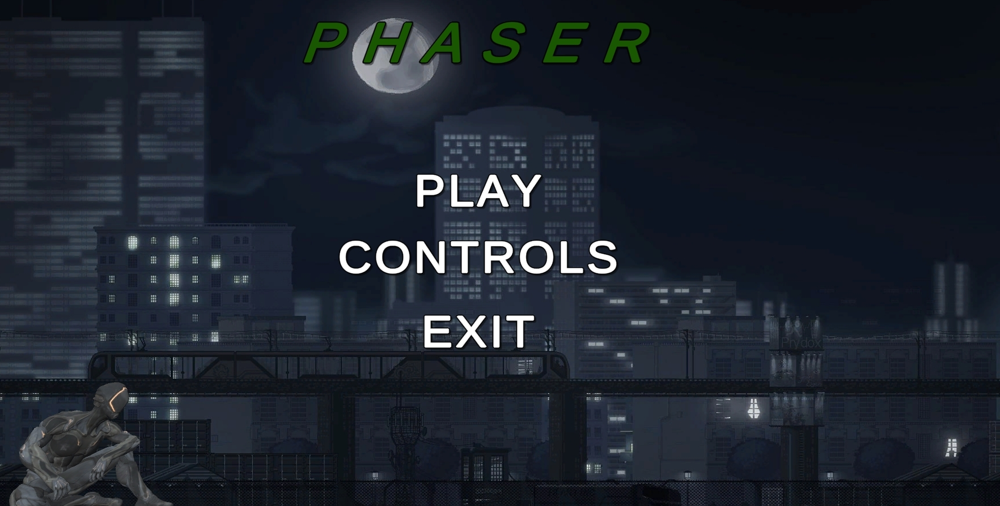
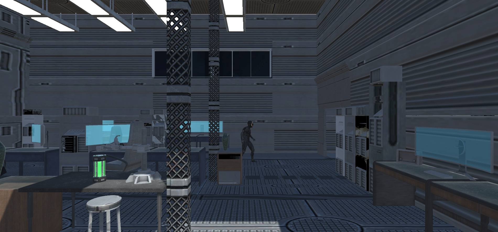
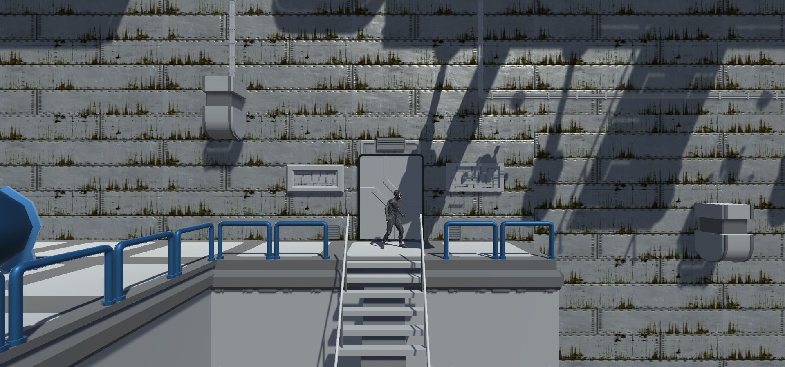

# Phaser
My first take on Unity platformer game.

## About The Project
Phaser is a 2.5 D platformer game set in a sci-fi world and made in Unity.

## Requirements
Make sure you have the below requirements before starting:

+ Unity version 2020.3.2f1 or higher

## Installation

+ Clone the repository locally:
```
git clone https://github.com/DankanMitius/Phaser.git
```

You can run the game by opening the project in Unity.

## Credits

+ Props and assets: https://assetstore.unity.com/
+ Character model and animations: https://www.mixamo.com/
+ Game Engine: Unity

## Tips & Tricks

+ Use teleport ability to overcome obstacles.
+ Avoid mechanical spiders.
+ Drones can knock you off.

Good luck and enjoy!

## Screenshots





